# Demo Jenkins pipeline with Flyway migrates and deploy on Minikube

Esta é uma demonstração de execução de uma pipeline do Jenkins que pega o código deste repositório git "***PULL***", aplica 
o migrates do Flyway no banco de dados Postgresql, constroi a aplicação com o Gradle, cria a imagem Docker, faz o "***PUSH***" 
desta imagem para o DockerHub e depois realiza o "***DEPLOY***" desta aplicação no Minikube.

## Passos para execução:

### 1º Instalar e inicializar o Minikube, Postgresql e o Jenkins

***Jenkins:***

O Jenkins pode ser instalado em um Docker, Kubernetes, Linux e vários outros sistemas.

Nesta demonstração será usado o Jenkins instalado no ***Linux***.

Mais informações sobre a instalação do Jenkins estão disponíveis na sua documentação oficial:

https://www.jenkins.io/doc/book/installing/

Para instalar o ***Jenkins*** no Linux ***Debian/Ubuntu***:

#### Executar: 

***sudo apt-get update***

***sudo apt-get install jenkins***

#### Instalação do Java:

Jenkins requer Java para rodar, mas certas  versões de Java são incompatíveis com Jenkins.

***sudo apt install openjdk-17-jre***

#### Iniciar Jenkins:

Você pode ativar o serviço Jenkins para iniciar na inicialização do sistema Linux com o comando:

***sudo systemctl enable jenkins***

Ou você pode iniciar o serviço Jenkins com o comando:

***sudo systemctl start jenkins***

Você pode verificar o status do serviço Jenkins usando o comando:

***sudo systemctl status jenkins***

Se tudo foi configurado corretamente, você deve ver uma saída como esta:

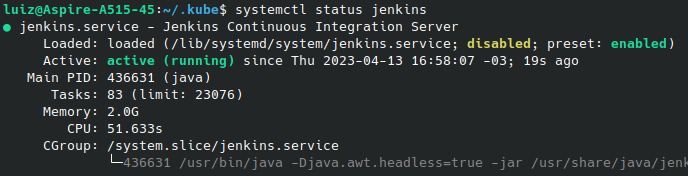

### 2º Acessar a pagina do Jenkins:
***http://localhost:8080/***

#### Adicionar credenciais no Jenkins:

http://localhost:8080/manage/credentials/

Clicar em:

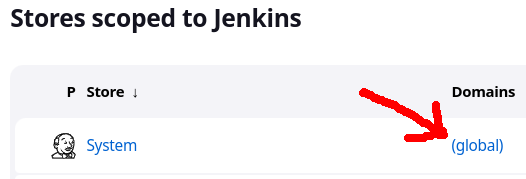

Na tela que abrir, no seu canto superior direito, clicar em "+ Add Credentials":

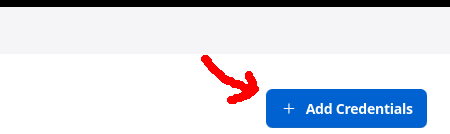

Crie uma credencial com o ***ID*** "*postgres*" do tipo "***Username with password***", com seus respectivos username e password,
para que o executor do pipeline possa acessa-lo;

Crie uma credencial com o ***ID*** "*login_DockerHub*" do tipo "***Username with password***", com seus respectivos username e password,
para que o executor do pipeline possa acessa-lo;

Ao criar uma credencial com o ***ID*** "*Kubernetes*" do tipo "***Kubernetes configuration (kubeconfig)***", 
em "***Kubeconifig***", click em "***Enter directly***":

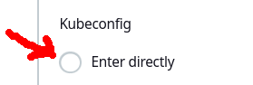

Depois para poder preencher o ***Content***, 

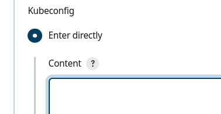

vá ao terminal de comandos do linux, vizualize o conteúdo do arquivo ***config*** do **minikube**,
geralmente encontrado no diretório: /home/*{seu usuário}*/.kube

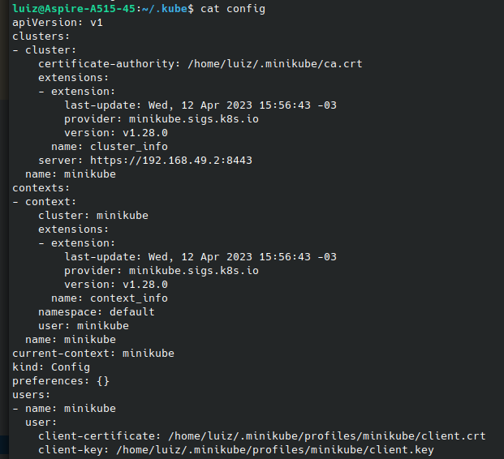

Copie este conteúdo do arquivo config e cole no o ***Content***.

Ainda no ***Content***,
altere ***certificate-authority*** para ***certificate-authority-data*** e substitua o caminho do arquivo de certificado
"*/ca.cr" pelo seu conteúdo codificado em base64.

No terminal dp Linux execute o comando para obter este conteúdo codificado em base64: 

***cat "certificate file" | base64***

Repita o mesmo procedimento:

Altere ***client-certificate*** para ***client-certificate-data*** e digite a string codificada em base64 do arquivo de certificado */client.crt;

Altere ***client-key*** para ***client-key-data*** e digite a string codificada em base64 do arquivo de certificado*/client.key.

O resultado deve ficar assim:

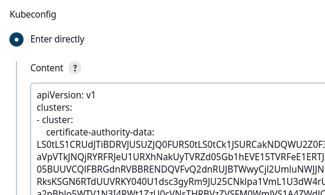

### Adicionar a extensão Flyway Runner:

Acesse o gerenciador de extensões do Jenkins:

http://localhost:8080/manage/pluginManager/

Localize e instale o Flyway Runner:

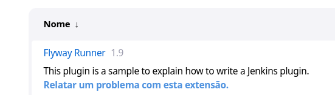

Localize e instale o Gradle:

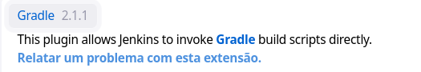

***Talvez seja necessária a instalação mais alguma extensão do Docker, DockerHub, Git, GitHub...!***

No caso de falha na execução da Pipiline do Jenkins, talvez tenha que instalar a extensão correspondente.

### Configurar o Jenkins:

http://localhost:8080/manage/configure

Em ***GitHub*** adicione um ***GitHub Server***:

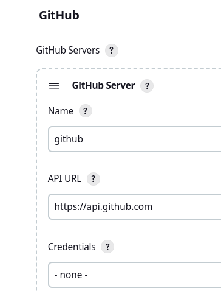

### Configurar ferramentas de Configuração Global:

http://localhost:8080/manage/configureTools/

Localize o Gradle na página acima e adicione esta versão:

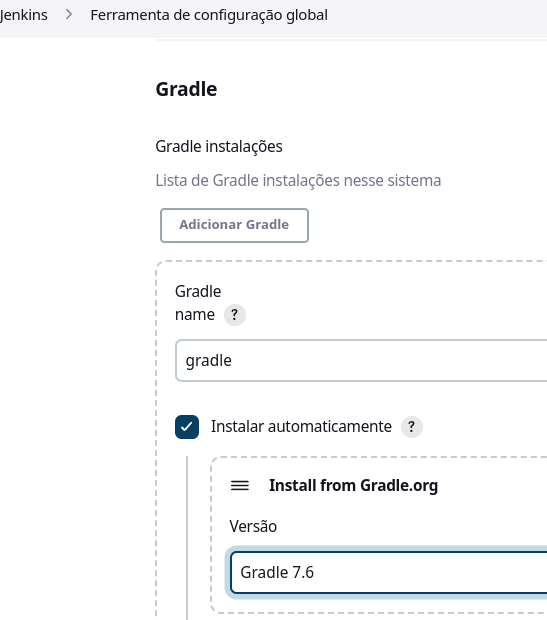

Localize o Flyway e adicione exatamente esta versão:

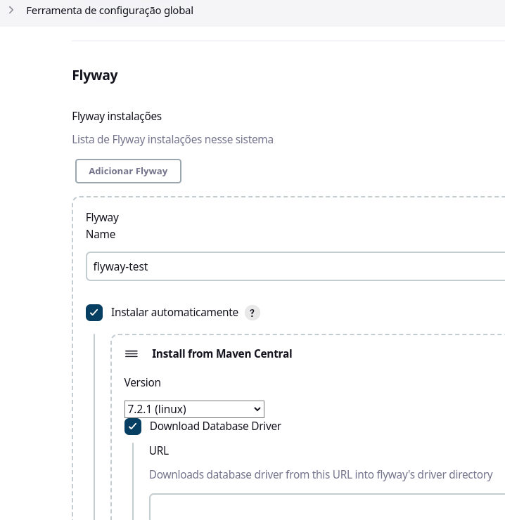

### Clonar este repositório

Clonar este repositório será preciso somente caso aja necessidade e alterar algum arquivo, como o ***Jenkinsfile***.

### Criar uma nova Pipeline no Jenkins

Na página inicial do Jenkins, click em "***+ Nova tarefa***":

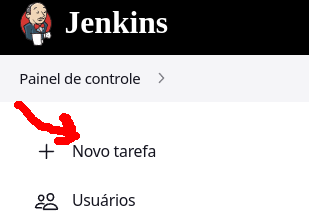

Depois coloque um nome para a tarefa, escolha Pipeline e depois click no botão Tudo certo:

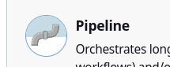

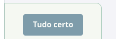

Em GitHub project, insira a url deste repositório ou a do seu próprio repositório:

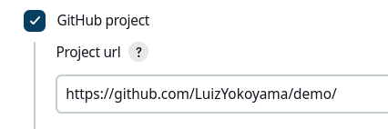

Em ***Pipeline > Definition*** escolha ***Pipelline script from SCM*** e preencha assim:

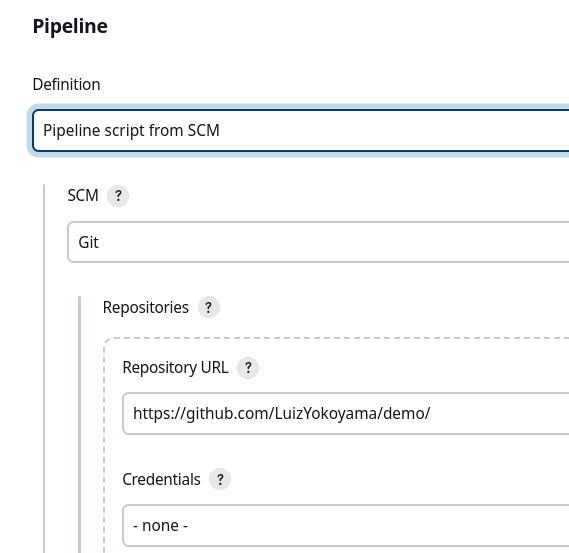

Em ***Pipeline > Script Path*** preencha com Jenkinsfile, para este arquivo do repositório ser usado na pipeline:

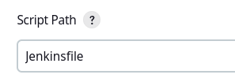

### Ajustes no Jenkinsfile

Podem ser necessários alguns ajustes no Jenkinsfile, como por exemplo os IDs de credenciais ou o URL do postgres:

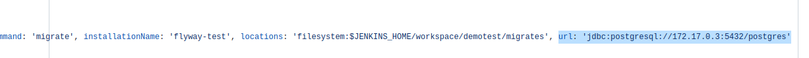

### Executando a pipeline do Jenkins

Por último, basta clicar em construir agora:

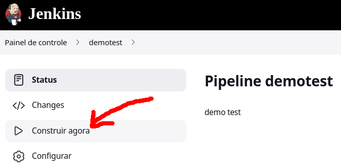

Se tudo der certo, poderá ser possível ver a pipeline executando:

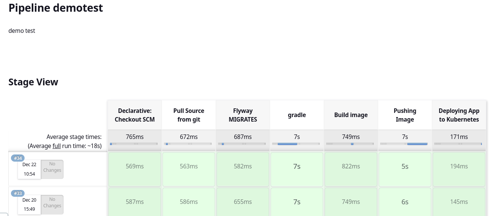